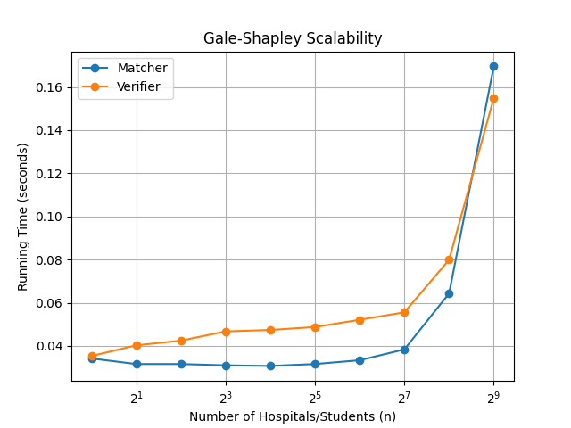

## Names/UFIDs
Arthur Zanoelo (93116277) and Matthew Beutel (35151278)

## How to Compile
This program is written in python so you only need to run it.

Just remember to cd to the correct folder.

## How to Run Matching Algorithm
Given an input file (example.in), in PowerShell run:

(To print out results in terminal)

```Get-Content example.in | python GaleShapleyAlg.py match```

(To create new file with output)

```Get-Content -Raw example.in | python GaleShapleyAlg.py match | Out-File output.out -Encoding ascii```

## How to Run Verifying Algorithm
Give an input file and an output file, in PowerShell run:

```python GaleShapleyAlg.py verify example.in output.out```

## Assumptions
If you want to run our graph code, you have to have matplotlib installed.

## Graph and Solution
Upon running our python code for the graph, we observed an exponential growth, which indicated a O(n^2) running time.


